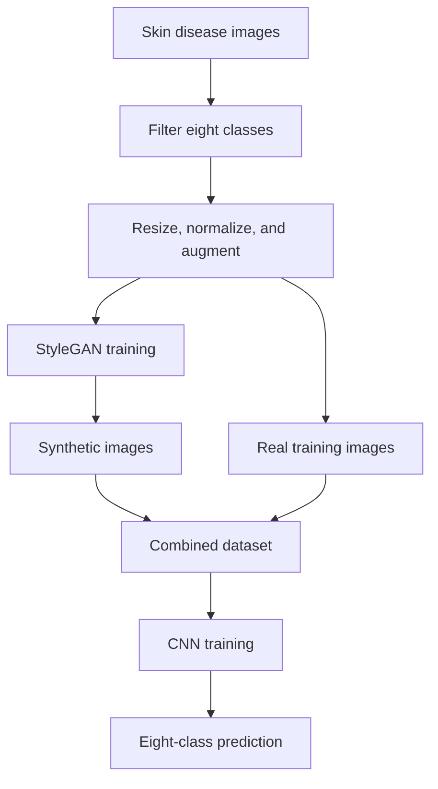

# Skin Disease Classification Using StyleGAN and CNN

A deep learning project that combines **StyleGAN-based synthetic image generation** with a **Convolutional Neural Network (CNN)** to classify skin disease images while addressing limited labeled data and class imbalance.

> **Important:** This project is intended for academic research and decision support only. It is not a medical device and must not be used as a substitute for diagnosis by a qualified healthcare professional.

## Overview

Skin disease classification is challenging because several conditions have similar visual characteristics, labeled medical images can be difficult to obtain, and datasets are often imbalanced. These issues can cause classification models to favor well-represented classes and generalize poorly to less common conditions.

This project uses a two-stage pipeline:

1. A StyleGAN-based model generates additional class-specific synthetic images.
2. A CNN is trained on the combined real and synthetic image dataset for multiclass classification.

The goal is to increase training diversity, reduce class imbalance, and improve the CNN's ability to distinguish among visually similar skin conditions.

## Dataset

The original skin disease dataset was obtained from Kaggle and contains images from **22 disease classes**. This project uses a subset of **eight representative classes**. Conditions discussed in the project report include:

- Acne
- Eczema
- Psoriasis
- Rosacea
- Seborrheic keratoses
- Tinea
- Warts

## Data Preprocessing

The image-preparation pipeline includes:

- Filtering the original dataset to the eight selected classes
- Resizing images to `128 x 128` pixels
- Converting images into tensors
- Normalizing RGB pixel values to the range `[-1, 1]`
- Integer-encoding class labels for multiclass classification
- Applying augmentation to improve diversity and generalization:
  - Random rotation
  - Horizontal and vertical flipping
  - Affine translation and shear
  - Brightness, contrast, and saturation jitter

## Methodology

### 1. StyleGAN-Based Image Generation

The generative stage uses a StyleGAN architecture with class-controlled generation logic to produce synthetic samples for selected disease categories. The model contains:

- A mapping network that transforms latent vectors into an intermediate latent space
- A synthesis network that generates images using learned style representations
- A generator trained to create realistic class-specific samples
- A discriminator trained to distinguish real images from generated images

The generated samples are combined with the original training data to improve class representation and intra-class diversity.

#### StyleGAN Training Configuration

| Parameter | Value |
|---|---:|
| Resolution | 128 x 128 |
| Epochs | 200 |
| Batch size | 128 |
| Optimizer | Adam |
| Adam beta values | beta1 = 0.0, beta2 = 0.99 |

### 2. CNN Classification

The supervised stage uses a CNN for eight-class image classification. Its architecture includes convolutional layers, ReLU activation, max-pooling, batch normalization, dropout, and fully connected layers.

#### CNN Training Configuration

| Parameter | Value |
|---|---:|
| Epochs | 50 |
| Optimizer | AdamW |
| Learning rate | 0.0005 |
| Dropout | 0.3 |
| Weight decay | 1e-4 |
| Loss function | Categorical cross-entropy |

## Pipeline

## Results

### StyleGAN

| Metric | Result |
|---|---:|
| Final reported epoch | 190 / 200 |
| Discriminator loss | 0.38 |
| Generator loss | 2.3220 |

The generated images provided additional class examples, although their photorealism was limited by the available training time and hardware resources.

### CNN Classifier

| Metric | Result |
|---|---:|
| Training loss | 0.32 |
| Training accuracy | **88.38%** |
| Validation loss | 0.80 |
| Validation accuracy | **79.11%** |

Selected class accuracies reported during evaluation:

| Class | Accuracy |
|---|---:|
| Warts | 97% |
| Acne | 85% |
| Tinea | 69% |
| Psoriasis | 68% |
| Rosacea | 66% |

The results indicate that the classifier performed better on visually distinctive categories and experienced more confusion among conditions with similar visual patterns.

## Comparative Evaluation

The project also replicated and evaluated several baseline approaches, including:

- ResNet-based classifiers
- Artificial Neural Network (ANN)
- Support Vector Machine (SVM)
- K-Nearest Neighbors (KNN)
- Decision Tree
- ResNet-18

Performance generally declined when these approaches were evaluated on the project's more complex and imbalanced dataset, highlighting the challenges of domain differences, visual similarity, class imbalance, and real-world image noise.

## Technologies and Concepts

- Python
- Deep learning
- Convolutional Neural Networks
- StyleGAN
- Generative Adversarial Networks
- Medical image classification
- Synthetic data augmentation
- Multiclass classification
- Image preprocessing and augmentation
- Batch normalization
- Dropout and L2 regularization

## Contributors

- Amal Alharbi
- Balsam Alahmari
- Rawnaa Miran
- Sara Abduljabbar
- Rahaf Jelan

University of Jeddah — College of Computer Science and Engineering  

